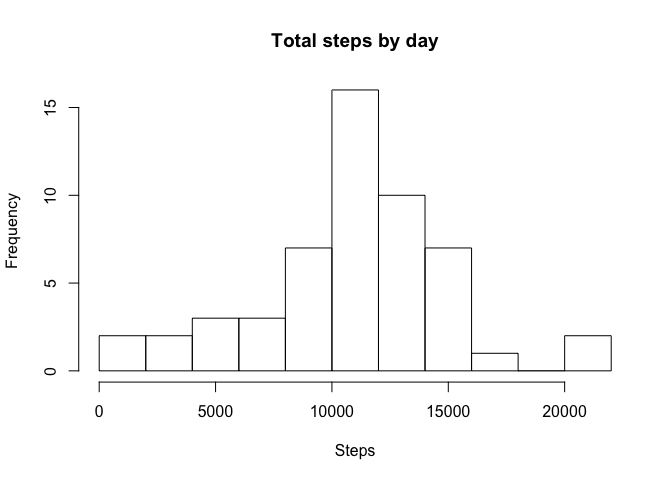
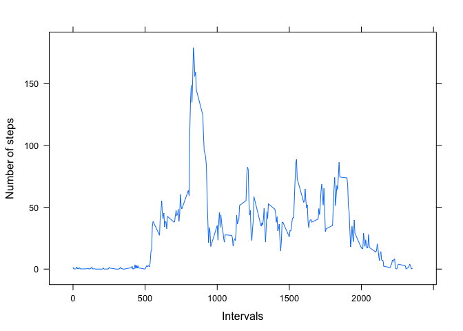
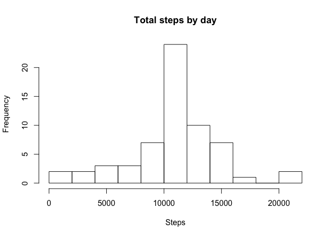
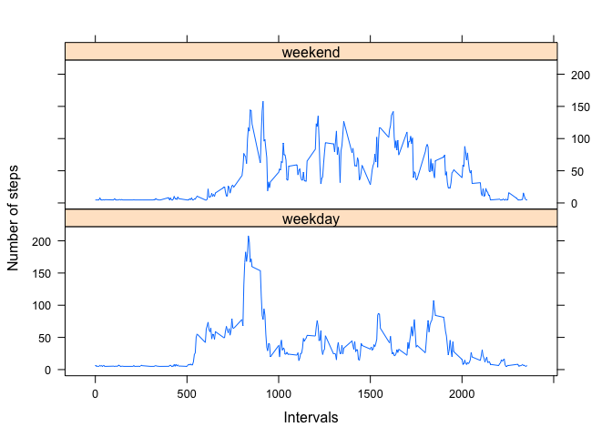

# Reproducible Research: Peer Assessment 1

## Loading and preprocessing the data


After cloning and downloading Master, retrieve and transform data.


```r
library(data.table)
library(dplyr)
```

```
## 
## Attaching package: 'dplyr'
```

```
## The following objects are masked from 'package:data.table':
## 
##     between, first, last
```

```
## The following objects are masked from 'package:stats':
## 
##     filter, lag
```

```
## The following objects are masked from 'package:base':
## 
##     intersect, setdiff, setequal, union
```

```r
library(tidyr)
library(lattice)

unzip(zipfile = "activity.zip")
df <- fread("activity.csv", header = TRUE, sep = ",")
df$date = as.Date(df$date, '%Y-%m-%d')
```

## What is mean total number of steps taken per day?


#### 1. Make a histogram of the total number of steps taken each day

Using a variation of Histogram to display total number/steps (y-axis) per day (x-axis) to show how the record looks like over the 2-month period.


```r
dfByDay <- df %>% 
        group_by (date) %>% 
        summarise(total = sum(steps))

hist(dfByDay$total, breaks = 10, xlab = "Steps", main = 'Total steps by day')
```

<!-- -->


#### 2. Calculate and report the mean and median total number of steps taken per day

If one **ignores missing value** by removing missing value rows, the **Mean** and **Median** are 10766 and 10765, repectively


```r
Mean <- mean(dfByDay$total, na.rm = TRUE)
Median <- median(dfByDay$total, na.rm = TRUE)

Mean
```

```
## [1] 10766.19
```

```r
Median
```

```
## [1] 10765
```


## What is the average daily activity pattern?

#### 1. Make a time series plot (i.e. type = "l") of the 5-minute interval (x-axis) and the average number of steps taken, averaged across all days (y-axis)

Looking at the plot per 5-min interval, the max number of steps is between 150 and 200 and occurs after 7 and before 10 am. During the day, some smaller peaks also occur aroud 12 (lunch, perhaps?), just after 3 pm and again around 6 pm.


```r
dfByInterval <- df %>% 
        replace_na(list(steps = 0)) %>%
        group_by (interval) %>% 
        summarise(avg = mean(steps))

xyplot(avg~interval, data=dfByInterval, type = "l", 
       xlab = 'Intervals', ylab = 'Number of steps')
```

<!-- -->


#### 2. Which 5-minute interval, on average across all the days in the dataset, contains the maximum number of steps?

By arranging average steps per Interval across all dates in descending order, we can see the highest no. of steps is from 8:35 am and with 179 steps. 


```r
dfByIntervalArrange <- dfByInterval %>% 
        arrange(-avg)

dfByIntervalArrange[1,]
```

```
## # A tibble: 1 x 2
##   interval      avg
##      <int>    <dbl>
## 1      835 179.1311
```


## Imputing missing values

#### 1. Calculate and report the total number of missing values in the dataset
(i.e. the total number of rows with NAs)

One can derive number of NA value in steps by using `summary(df)`. Alternatively, using `is.na` as shown below. There are 2304 NA value.


```r
NA_count <- sum(is.na(df$steps))
NA_count
```

```
## [1] 2304
```


#### 2. Devise a strategy for filling in all of the missing values in the dataset. 3. Create a new dataset that is equal to the original dataset but with the missing data filled in.

Here we replace (or impute) all the NA values with **Mean** per 5-min interval.


```r
dfNew <- df %>% 
        replace_na(list(steps = mean(df$steps, na.rm=TRUE)))
```


#### 4. Make a histogram of the total number of steps taken each day and Calculate and report the mean and median total number of steps taken per day.

Re-calculate total steps per date now with missing value replaced by 5-min interval **Mean**. Histogram shows high frequency on the imputed missing value days.


```r
dfByDayNew <- dfNew %>% 
        group_by (date) %>% 
        summarise(total = sum(steps))

hist(dfByDayNew$total, breaks = 10, xlab = "Steps", main = 'Total steps by day')
```

<!-- -->

After imputing missing value, the **Mean** is the same as before and **Median** are different.


```r
MeanNew <- mean(dfByDayNew$total)
MedianNew <- median(dfByDayNew$total)

MeanNew
```

```
## [1] 10766.19
```

```r
MedianNew
```

```
## [1] 10766.19
```


## Are there differences in activity patterns between weekdays and weekends?


#### 1. Create a new factor variable in the dataset with two levels – “weekday” and “weekend” indicating whether a given date is a weekday or weekend day.

Here we need to create a factor variable of **weekday** and **weekend**. By using `weekdays()`, we get Monday, Tuesday, etc. Further transformation to create the 2-level factor we need. View selected rows.


```r
dfNew$weekday = weekdays(dfNew$date)
dfNew$weekday = ifelse(dfNew$weekday == 'Saturday' | dfNew$weekday == 'Sunday',
                        c("weekend"), c("weekday")) 
dfNew[1440:1445,]
```

```
##    steps       date interval weekday
## 1:     0 2012-10-05     2355 weekday
## 2:     0 2012-10-06        0 weekend
## 3:     0 2012-10-06        5 weekend
## 4:     0 2012-10-06       10 weekend
## 5:     0 2012-10-06       15 weekend
## 6:     0 2012-10-06       20 weekend
```

#### 2. Make a panel plot 

Calculate steps total by group Interval and Weekday and display results in vertical layout panels.

Plot shows during weekend the 5-min interval "peaks" start slightly later at the beginning of the day and in general more steps are taken throughout the rest of the day. 


```r
dfByIntervalWeekday <- dfNew %>% 
        group_by (interval, weekday) %>% 
        summarise(avg = mean(steps))

xyplot(avg~interval | weekday, data=dfByIntervalWeekday, type = "l", 
       xlab = 'Intervals', ylab = 'Number of steps', layout = c(1,2))
```

<!-- -->

